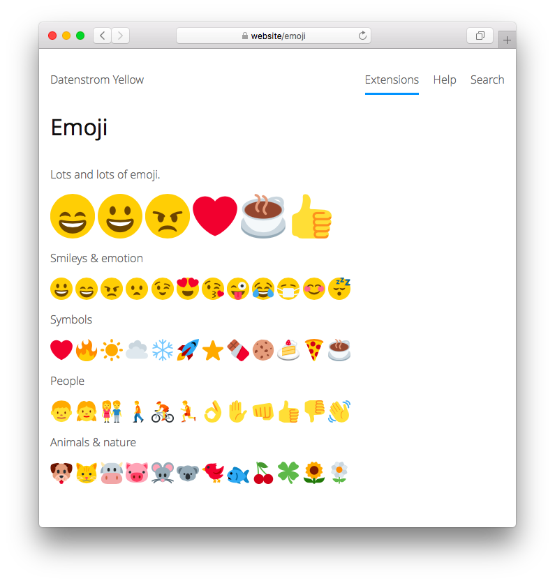

<a href="README-de.md">Deutsch</a> &nbsp; <a href="README.md">English</a> &nbsp; <a href="README-sv.md">Svenska</a>

# Emoji 0.8.14

Lots and lots of emoji.

## How to install an extension

[Download ZIP file](https://github.com/annaesvensson/yellow-emoji/archive/refs/heads/main.zip) and copy it into your `system/extensions` folder. [Learn more about extensions](https://github.com/annaesvensson/yellow-update).

## How to add an emoji

Add `:shortcode:` to the text of a page. Here's an [emoji cheat sheet](https://github.com/ikatyang/emoji-cheat-sheet). 

It's also possible to create an `[emoji]` shortcut or use HTML. You can add an optional style, for example `emoji-2x`, `emoji-3x`, `emoji-4x` and `emoji-5x`.

## Examples

Adding an emoji:

    :smile: 
    :heart: 
    :coffee:

Adding an emoji with shortcut, different sizes:

    [emoji emoji-smile]
    [emoji emoji-heart emoji-2x]
    [emoji emoji-coffee emoji-3x]

Adding an emoji with HTML, different sizes:

    <i class="emoji emoji-smile" aria-label="smile"></i>
    <i class="emoji emoji-heart emoji-2x" aria-label="heart"></i>
    <i class="emoji emoji-coffee emoji-3x" aria-label="coffee"></i>

Smileys & emotion:

    :grinning:           :smile:              :angry:
    :frowning:           :wink:               :heart_eyes:
    :kissing_heart:      :stuck_out_tongue_winking_eye:
    :joy:                :mask:               :blush:
    :sleeping:

## Settings

The following settings can be configured in file `system/extensions/yellow-system.ini`:

`EmojiToolbarButtons` = toolbar buttons for the [edit extension](https://github.com/annaesvensson/yellow-edit)  

## Acknowledgements

This extension includes [Twemoji 13.0.0](https://github.com/twitter/twemoji) by Twitter. Thank you for the beautiful emoji.

## Developer

Anna Svensson. [Get help](https://datenstrom.se/yellow/help/).
