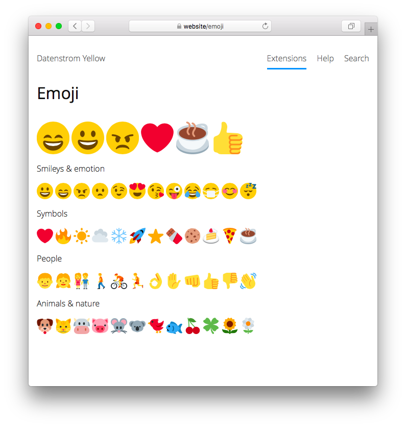

# Emoji 0.9.4

Lots and lots of emoji. Developed by Anna Svensson.

## How to install an extension

[Download ZIP file](https://github.com/annaesvensson/yellow-emoji/archive/refs/heads/main.zip) and copy it into your `system/extensions` folder. [Learn more about extensions](https://github.com/annaesvensson/yellow-update).

## How to add an emoji

Add `:smile:` or `[emoji emoji-smile]` to the text of a page. Here's an [emoji cheat sheet](https://github.com/ikatyang/emoji-cheat-sheet).

## How to add an emoji to a layout file

Use the HTML format, for example `<i class="emoji emoji-smile" aria-label="smile"></i>`.

## Examples

Content file with emoji:

    ---
    Title: Example page
    ---
    This is an example page with emoji.

    :smile: :grinning: :angry: :heart: :coffee: :thumbsup:

Adding an emoji by name:

    :smile: 
    :heart: 
    :coffee:

Adding an emoji with shortcut:

    [emoji emoji-smile]
    [emoji emoji-heart]
    [emoji emoji-coffee]

Adding an emoji with HTML:

    <i class="emoji emoji-smile" aria-label="smile"></i>
    <i class="emoji emoji-heart" aria-label="heart"></i>
    <i class="emoji emoji-coffee" aria-label="coffee"></i>

Smileys & emotion:

    :grinning:           :smile:              :angry:
    :frowning:           :wink:               :heart_eyes:
    :kissing_heart:      :stuck_out_tongue_winking_eye:
    :joy:                :mask:               :blush:
    :sleeping:

## Settings

The following settings can be configured in file `system/extensions/yellow-system.ini`:

`EmojiToolbarButtons` = toolbar buttons for the [edit extension](https://github.com/annaesvensson/yellow-edit)  

## Acknowledgements

This extension includes [Twemoji 13.0.0](https://github.com/twitter/twemoji) by Twitter. Thank you for the beautiful emoji.

Do you have questions? [Get help](https://datenstrom.se/yellow/help/).
